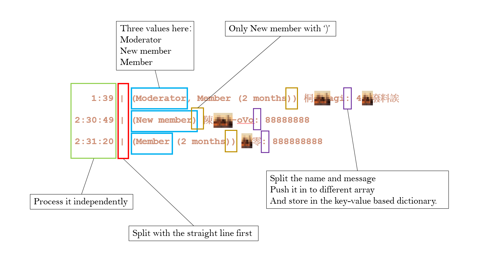
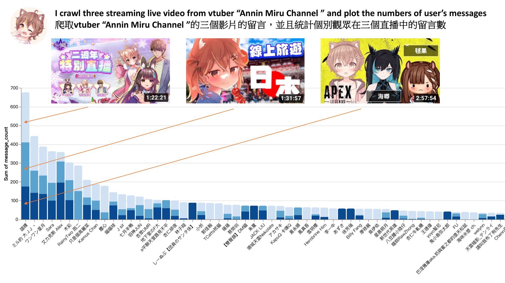
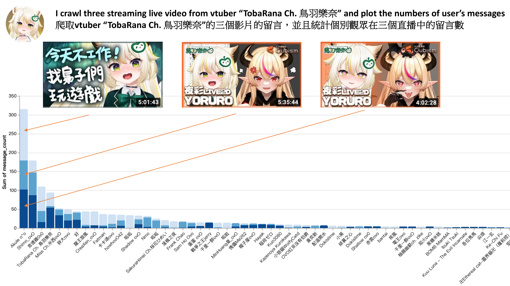
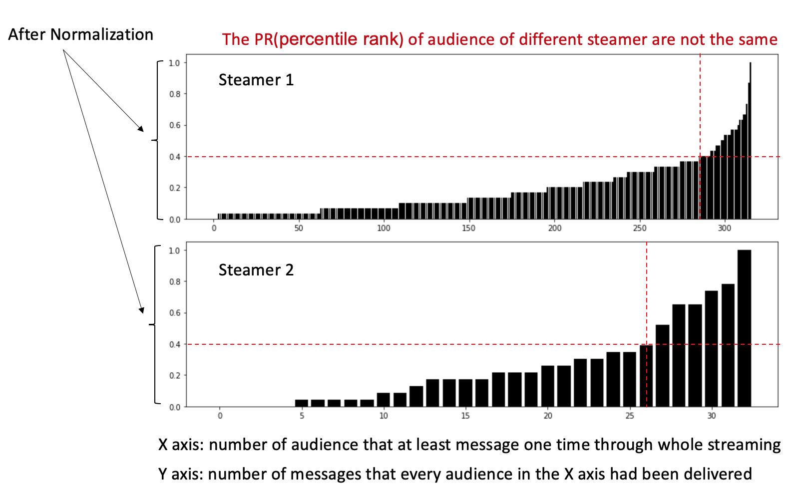
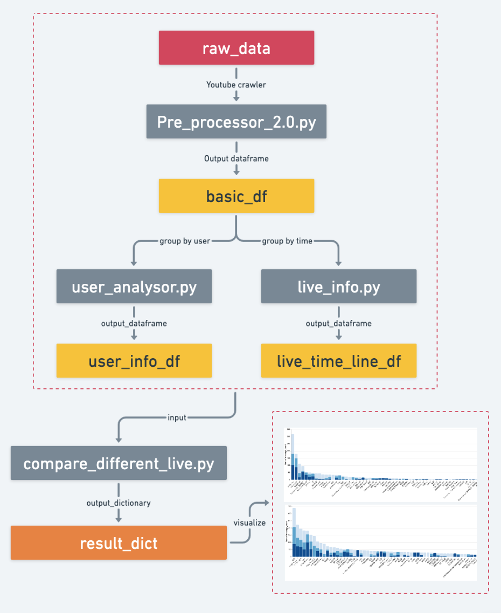
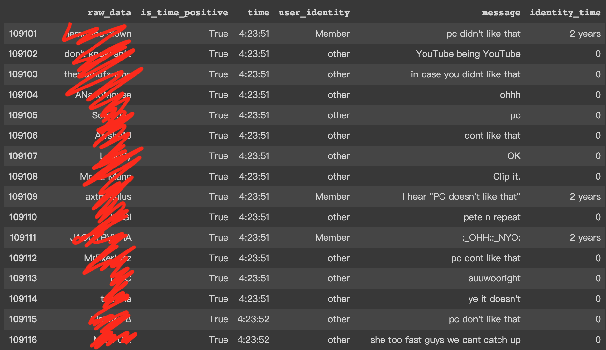
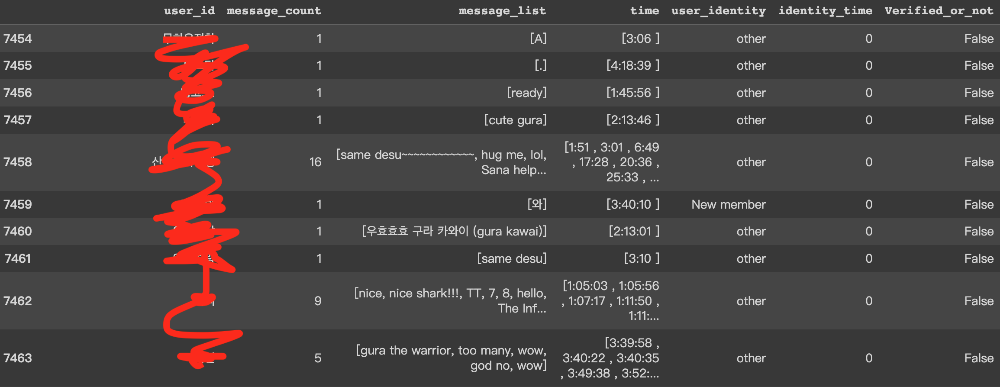
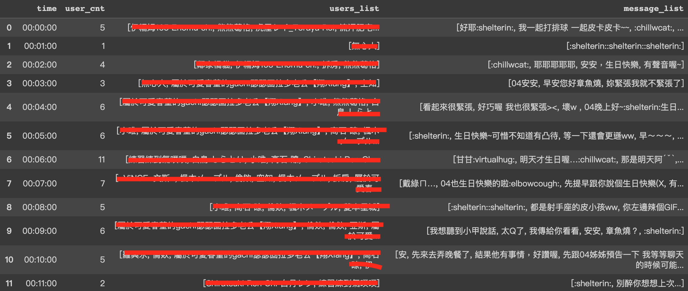

# Youtube Streaming Analysor

-------------------------------

This is a tool for analysis youtuber/vtuber streaming data
, focus on chat/user pairs data analysis.

currently only pre-process function now.

process of analysis below:

(with brown pixelization on user name)

(process data flow by split chracters.)

Three examples(based on user's messages):

Data pipeline:

Below is how it look like of every output.

Pre_processor_2.0.py output:

user_analysor.py output:

live_info.py output:

reference:
https://github.com/xenova/chat-downloader

-------------------------------
TO DO: 
1. Clarify the problem of the ":" sign between name and message.

2. Automatically compare different streamers and different live stream.

-------------------------------
Problems list:
1. Users id are not unique.

2. Users id is changeable.

-------------------------------

TIME LINE

2022.12.19: 以get_streams_from_channel.py達成頻道直播爬蟲自動化，輸入頻道連結與想爬取的直播url數量，即可取得想要的結果，特別的是我使用下列套件，並且將其修改以符合我的使用需求

reference:https://github.com/dermasmid/scrapetube

2022.12.19: Use get_streams_from_channel.py to automatically crawle the url of particular channel.

reference:https://github.com/dermasmid/scrapetube

2022.12.19: 

2022.12.18: 修正名稱開頭有'()'者導致的身份識別錯誤與姓名切割錯誤

2022.12.18: Fix the problem of the starting of the user id include '()'.

2022.12.17: 新增live_info.py，可以依據live時間（分鐘數）計算使用者留言量、使用者list、留言list，如果該時間沒有留言，會顯示0個使用者、以及兩個空白list

2022.12.17: Upload live_info.py, it based on minutes to summarized user/messages information.

2022.12.15: 新增user_analysor.py檔案，功能是彙整該直播中的所有使用者資訊，另外之前沒考量的Verified身份也在這次更新中修正完成

2022.12.15: Upload user_analysor.py, I use it to summarize user information in a streaming live, also I fix the 'Verified' identity problem. In the original version, I didn't consider the 'Verified' identity.

2022.11.22: 更改data pipeline，從直接匯入df改成先以list承接再統一匯入df，此舉改善11/21版本近十倍的效能（使用同一支直播影片測試，總花費CPU time從366下降到30）。對比Pre_processor.py，此版本增進了40%左右的效能，並且具備更多欄位，能達成更多目的

2022.11.22: Fix the data pipeline, use list to store raw data instead of using df directly, and improve 10 times of efficiency compare with the version build in 11.21. This version is 40% more efficiency compare with Pre_processor.py.

2022.11.21: 完成2.0版本的初步內容，以Pre_processor_2.0.py為檔案名稱，捨棄list與dict的資料裝載方式，清洗後的資料全面改用pandas的dataframe裝載

2022.11.21: Finish the 2.0 version, use dataframe to store the data

2022.11.19: 計劃用pandas把pipeline重構成更有效率的處理方式

2022.11.19: TO DO: Use pandas package to refactor the data pipeline.

2022.10.16: 10.15提出的問題已修復

2022.10.16: Update: problem mention at 10.15 solved.

2022.10.15: 目前會有一個問題：如果使用者名稱中有New, Member等詞彙會造成判斷錯誤，修改中

2022.10.15: Currently problem: once there is "New" or "Member" in the user ID, error occour, fixing.

2020: 製作最早版本的Pre_processor.py

2020: Upload Pre_processor.py
