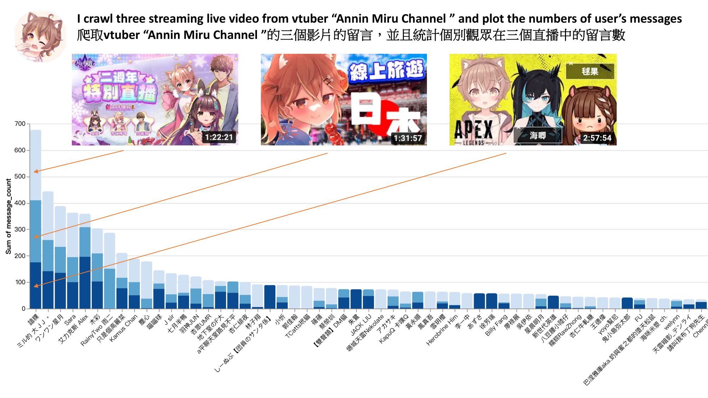
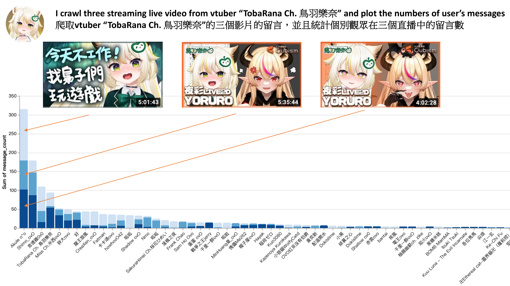
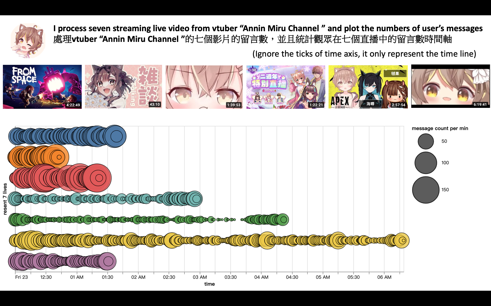
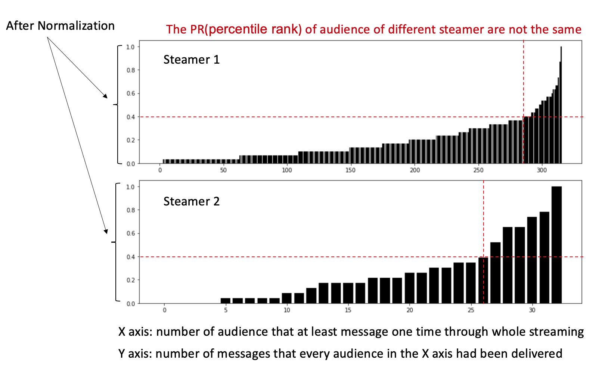

# Youtube Streaming Analysor

-------------------------------

This is a project for analysis of YouTuber/vtuber streaming data, focusing on chat/user pairs data analysis. If you are interested in the evolution, see the Change Log(更新時間軸) of this side-project below.

This data pipeline is currently migrated to the Google Cloud platform. Please see the simplified architecture diagram below for the system structure.

📈 [Dashboard](https://lookerstudio.google.com/reporting/d0c687bd-2e96-4fac-ac9a-f1d5844fe8d8) 

📝 [Article: System Architecture and Challenges](https://stephendatavisualization.substack.com/p/building-a-lambda-architecture-gcp)

-------------------------------

潛在問題集(Potential issues list):

1. 由於 batch update 的系統限制，如果直播影片被下架則只能抓到即時觀看數，其他資料無法抓取(Due to the system limitations of batch updates, if the live video is taken down, only the real-time view count can be captured, and other data cannot be retrieved.)

-------------------------------

Change Log 更新時間軸

2024.07.14: 更新 Looker Studio 視覺效果，加入 online 觀眾折線圖。

2024.07.14: Update ploys in Looker Studio: add the viewer's count line chart.

2024.07.05: 由於 Youtube Data API 的配額限制過低，改用純爬蟲爬取直播狀態與觀看人數。

2024.07.05: Use Python crawler to get the streaming status and the viewers instead of Youtube Data API, because the quota of it is limited.

2024.06.30: 基於 Youtube Data API 增加一個新資料源 "當下觀眾數量"，並且基於此資料源建構一個新的資料管道。這個串流資料管道由 cloud function 與 pubsub 組成，提供直播當下的觀眾數量(資料顆粒度達到每分鐘)。

2024.06.30: Add a new data source "viewers count" based-on YouTube Data API, and construct a new pipeline with it. This pipeline is a streaming pipeline consisting of cloud function and pub/sub(Apache Kafka), providing streaming live viewers count per minute.

2024.05.19: 將 JOIN 操作搬遷到 Bigquery 進行，提高 30 倍的儀表板載入效率。(60秒 -> 2秒)

2024.05.19: Switching the JOIN operation to BigQuery increased the dashboard loading efficiency by 30 times. (60s -> 2s)

2024.05.02: 構思加入 youtube live stream online viewers numbers 的功能 (使用 API: https://developers.google.com/youtube/v3/getting-started?hl=zh-tw#quota)。

2024.05.02: Conceptualize a youtube live stream online viewers numbers feature. (API: https://developers.google.com/youtube/v3/getting-started?hl=zh-tw#quota)。

2024.05.01: 構思 Looker Studio (LS) 加速方案，主要方向會捨棄目前 LS 中大量的 tables JOIN 行為，LS 的大量 tables JOIN 已經在網路上被公認是影響儀表板載入速度的關鍵之一。因此目前會逐步將 LS 中的 JOIN 行為提前到 BQ 處理。

2024.05.01: Conceptualize a Looker Studio (LS) processing speed acceleration plan, primarily focusing on abandoning the extensive use of tables JOIN currently in LS. The substantial tables JOIN in LS has been widely recognized on the internet as one of the key factors affecting dashboard loading speed, the JOIN operation will pre-process in Bigquery instead.

2024.03.02: 加入 DBT trigger BQ pipeline 測試，成功，待部署到 prod 上。

2024.03.02: Finish DBT trigger BQ pipeline test, ready to implement on prod inv.

2023.07.20: 將整個流程搬遷到GCP上，用cloud function / Bigquery / Looker studio完成一系列的資料管道與儀表板

2023.07.20: move the project to GCP, using Cloud Function, Bigquery, Looker Studio to build a pipeline and dashboard.

2022.12.23: 修復live_info.py使用者計數上的錯誤

2022.12.23: Fix the bug of live_info.py.

2022.12.22: 新增單場直播的使用者統計功能

2022.12.22: Upload the user statistics function for a single live broadcast.

2022.12.21: 修復get_streams_from_channel.py中，limit小於尚未開始的直播數會回傳錯誤url數量的問題（但是目前是使用效率低的方法，之後可能要直接動source code來繼續改善）

2022.12.21: Fix the problem of get_streams_from_channel.py, now the return urls list is right.

2022.12.19: 以get_streams_from_channel.py達成頻道直播爬蟲自動化，輸入頻道連結與想爬取的直播url數量，即可取得想要的結果，特別的是我使用下列套件，並且將其修改以符合我的使用需求

2022.12.19: Use get_streams_from_channel.py to automatically crawl the URL of a particular channel.

reference:https://github.com/dermasmid/scrapetube

2022.12.18: 修正名稱開頭有'()'者導致的身份識別錯誤與姓名切割錯誤

2022.12.18: Fix the problem of the starting of the user id include '()'.

2022.12.17: 新增live_info.py，可以依據live時間（分鐘數）計算使用者留言量、使用者list、留言list，如果該時間沒有留言，會顯示0個使用者、以及兩個空白list

2022.12.17: Upload live_info.py, it based on minutes to summarized user/messages information.

2022.12.15: 新增user_analysor.py檔案，功能是彙整該直播中的所有使用者資訊，另外之前沒考量的Verified身份也在這次更新中修正完成

2022.12.15: Upload user_analysor.py, I use it to summarize user information in a streaming live, also I fix the 'Verified' identity problem. In the original version, I didn't consider the 'Verified' identity.

2022.11.22: 更改data pipeline，從直接匯入df改成先以list承接再統一匯入df，此舉改善11/21版本近十倍的效能（使用同一支直播影片測試，總花費CPU time從366下降到30）。對比Pre_processor.py，此版本增進了40%左右的效能，並且具備更多欄位，能達成更多目的

2022.11.22: Fix the data pipeline, use list to store raw data instead of using df directly, and improve 10 times of efficiency compare with the version build in 11.21. This version is 40% more efficiency compare with Pre_processor.py.

2022.11.21: 完成2.0版本的初步內容，以Pre_processor_2.0.py為檔案名稱，捨棄list與dict的資料裝載方式，清洗後的資料全面改用pandas的dataframe裝載

2022.11.21: Finish the 2.0 version, use dataframe to store the data

2022.11.19: 計劃用pandas把pipeline重構成更有效率的處理方式

2022.11.19: TO DO: Use pandas package to refactor the data pipeline.

2022.10.16: 10.15提出的問題已修復

2022.10.16: Update: problem mention at 10.15 solved.

2022.10.15: 目前會有一個問題：如果使用者名稱中有New, Member等詞彙會造成判斷錯誤，修改中

2022.10.15: Currently problem: once there is "New" or "Member" in the user ID, error occour, fixing.

2020: 製作最早版本的Pre_processor.py

2020: Upload Pre_processor.py

-----------------------------------------
圖集:

The following four plots are visualization examples(based on user's messages):

reference:
https://github.com/xenova/chat-downloader
